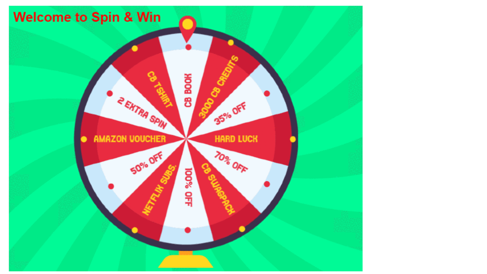

# Spin And Win Game

*A Simple game created using Html, CSS and Javascript framework Phaser.*

 

# FAQ

**Q1: How do I download the files?**

A: If you're new to GitHub and just want to download the complete package, hit the green button saying "Clone or download", choose the "Download ZIP" option, and you're good to go.

**Q2: How to run the game(file) ?**

A: After cloning the repository to your working directory, open the project in any brackets and then start the live server. Your game will be up and running.   

**Q3: Brackets shows me errors, but my code works. Why is that?**

A: These are not errors in your code, and you can simply ignore them (they just come from so-called linters that are not correctly set up).